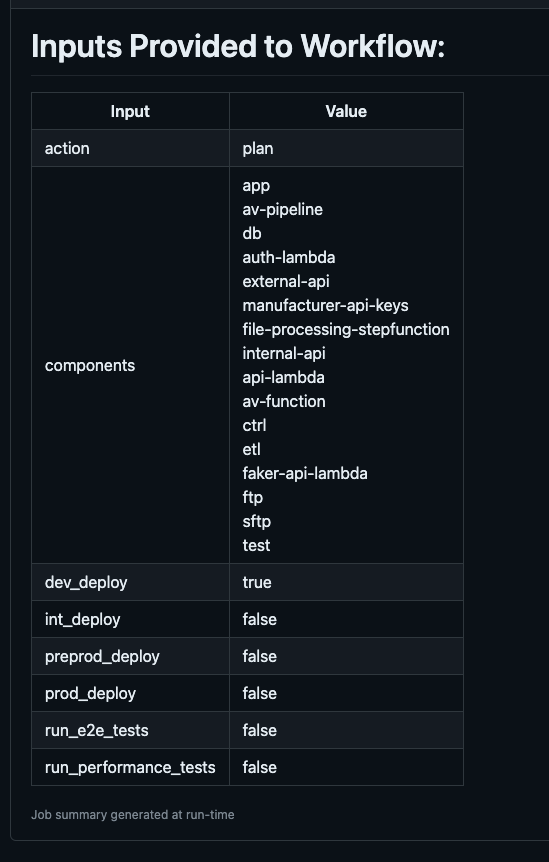

# Display Inputs to Workflow
Action to display the inputs to a workflow on the GitHub summary

####  Prerequisites
N/A

####  Context
This action allows the workflow to output its inputs to the GitHub Summary

####  Inputs
N/A

####  Outputs
table of inputs displayed on GitHub summary

Example: 

####  Usage
```yaml
- name: Display Inputs to Workflow
  uses: dvsa/.github/.github/actions/display-inputs@main
```