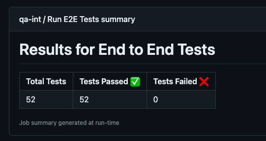

# Display Jest Test Summary
Action to output results of jest tests to Github summary

####  Prerequisites
Jest tests ran and JSON output file generated. See [docs](https://jestjs.io/docs/cli#--json) 

####  Context
This action allows the workflow to add a summary of jest test passes and failures to the GitHub summary
This does not display details of test failures, it can be used in addition to the 'github-actions' reporter as part of 
the jest config

####  Inputs
test_report_path (required): Path of test report JSON file

####  Outputs
Table of jest test results displayed on Github summary



####  Usage
```yaml
- name: Display Jest Test Summary
  uses: dvsa/.github/.github/actions/display-jest-test-summary@main
  with:
    test_report_path: 'test-report.html'
```
